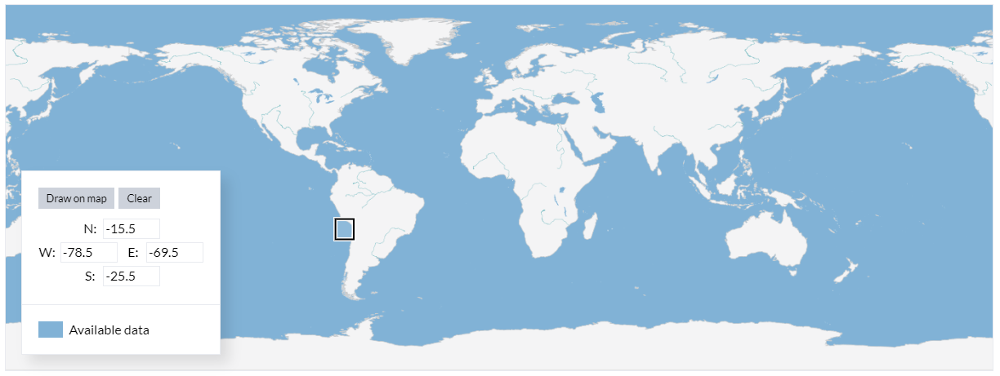
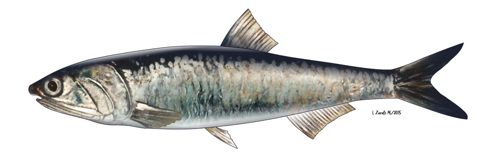

<<<<<<< HEAD
# **Informe Ocean Hack Week 2025**
=======
# Informe/Trabajo final
taller-intermedio-2025

-Archivo generado en R (Informe.qmd / Informe.html)

>>>>>>> 2a627f09aa5000aec1e1a59fde77730f42c0125b

## Dinámica oceanográfica y acústica de la anchoveta en el Sistema de Corrientes de Humboldt durante el 2020-2023"

-   Lenguaje: <https://www.r-project.org/>

-   Área de estudio: sur del Perú y norte de Chile.

-   Periodo: 2020, 2022 y 2023 durante los meses de septiembre a diciembre.

-   Datos satelitales: <https://cds.climate.copernicus.eu/datasets/reanalysis-era5-single-levels-monthly-means?tab=download> (TSM, @copernicusclimatechangeservice)

-   Datos acústicos: EK80-EK60 (38 y 120 kHz; @simmonds2005)

    {width="483"}

    [**Anchoveta** ***Engraulis ringens*** **Jenyns, 1842**](https://biodiversidadacuatica.imarpe.gob.pe/Catalogo/Especie?id=103)

-Jueves, 16 octubre 2025
