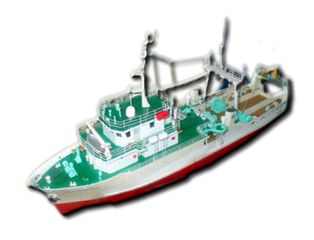

# **Informe Ocean Hack Week 2025**

## Dinámica oceanográfica y acústica de la anchoveta en el Sistema de Corrientes de Humboldt durante el 2020-2023"

-   Lenguaje: <https://www.r-project.org/>

-   Área de estudio: sur del Perú y norte de Chile.

-   Periodo: 2020, 2022 y 2023 durante los meses de septiembre a diciembre.

-   Datos satelitales: <https://cds.climate.copernicus.eu/datasets/reanalysis-era5-single-levels-monthly-means?tab=download> (TSM, @copernicusclimatechangeservice)

-   Datos acústicos: EK80-EK60 (38 y 120 kHz; @simmonds2005)

    {width="483"}

    [**Anchoveta** ***Engraulis ringens*** **Jenyns, 1842**](https://biodiversidadacuatica.imarpe.gob.pe/Catalogo/Especie?id=103)

    ## Motivación

    Los años 2020, 2022 y 2023 fueron seleccionados por presentar cruceros hidroacústicos consecutivos entre Perú y Chile, con fechas de camapañas compatibles en la zona fronteriza. Esta coincidencia temporal permite realizar analisis comparables del stock compartido de la anchoveta.

    +------------------------------------------------------------------------------------------------------------------------------------------------------------+--------------------------------------+
    | {width="9.6cm"} |  |
    |                                                                                                                                                            |                                      |
    |                                                                                                                                                            | Buque cientifico BIC Olaya           |
    +------------------------------------------------------------------------------------------------------------------------------------------------------------+--------------------------------------+

## Exploración de datos: imagenes satelitales

Esta figura presenta mapas mensuales de la temperatura superficial del mar (TSM) en la costa de Chile y Perú, generados a partir de datos satelitales. Cada panel corresponde a una combinación específica de año y mes, permitiendo observar la variabilidad espacio-temporal de la TSM en el Sistema de Corrientes de Humboldt.

Durante el periodo de ejecución de los cruceros hidroacústicos de Perú y Chile, que típicamente se desarrollan entre septiembre y diciembre, se ha calculado el promedio estacional de la temperatura superficial del mar (TSM) para representar las condiciones oceanográficas predominantes en la zona de estudio.

## Promedio de la TSM durante las campañas hidroacústicas

Entre septiembre y diciembre de los años 2020, 2022 y 2023, se observa un patrón claro de incremento progresivo de la temperatura superficial del mar (TSM) desde primavera hacia verano. Perú presenta sistemáticamente valores ligeramente más altos que Chile, con diferencias promedio entre 0.3 y 0.6 °C.

Tabla 1. Resumen mensual de TSM por país y promedio regional

| Year | Mes        | Chile |   Peú | Promedio_Regional |
|:-----|:-----------|:-----:|------:|------------------:|
| 2020 | septiembre | 16.28 | 16.57 |             16.43 |
| 2020 | octubre    | 16.84 | 17.39 |             17.11 |
| 2020 | noviembre  | 18.27 | 18.72 |             18.49 |
| 2020 | diciembre  | 20.01 | 20.58 |             20.29 |
| 2022 | septiembre | 15.64 | 15.95 |             15.79 |
| 2022 | octubre    | 16.17 | 16.26 |             16.21 |
| 2022 | noviembre  | 18.27 | 18.46 |             18.37 |
| 2022 | diciembre  | 20.92 | 21.29 |             21.10 |
| 2023 | septiembre | 18.09 | 18.47 |             18.28 |
| 2023 | octubre    | 18.41 | 18.80 |             18.61 |
| 2023 | noviembre  | 19.36 | 20.03 |             19.70 |
| 2023 | diciembre  | 20.42 | 20.97 |             20.69 |

## Asociación de la anchoveta y la TSM

Esta figura muestra la distribución espacial de la anchoveta en 2023, combinando datos acústicos (`NASC,`@maclennan2002) con la temperatura superficial del mar (TSM) promedio anual en la costa de Chile y Perú.

## **Referencias**

Copernicus Climate Change Service. s. f. «ERA5 monthly averaged data on single levels from 1940 to present». <https://doi.org/10.24381/CDS.F17050D7>.

MacLennan, David, Paul Fernandes, y John Dalen. 2002. «A consistent approach to definitions and symbols in fisheries acoustics». *ICES Journal of Marine Science* 59 (2): 365-69. <https://doi.org/10.1006/jmsc.2001.1158>.

Simmonds, J, y D MacLennan. 2005. *Fisheries acoustics: theory and practice*. 2nd ed. Fish y aquatic resources series 10. Oxford ; Ames, Iowa: Wiley-Blackwell. <https://onlinelibrary.wiley.com/doi/book/10.1002/9780470995303?msockid=27319c98976d69550ca088559680688f>.
